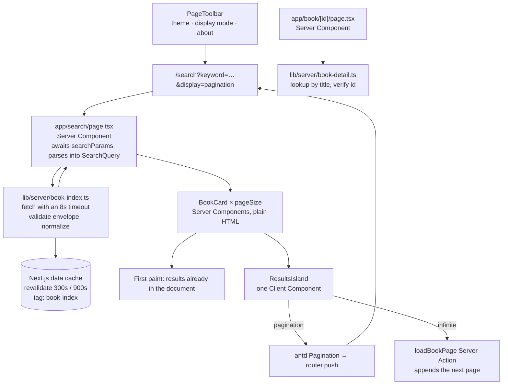

# Refactor: modern SSR rebuild

Branch: `refactor/modern-ssr` · worktree: `.worktrees/modern-ssr`

Navigation: [architecture](#2-data-flow) · [display mode](#3-the-display-mode-belongs-in-the-url) ·
[server/client boundary](#4-server-vs-client-boundary) · [caching](#5-caching-policy) ·
[egress proxy](#6-reaching-the-network-behind-an-egress-proxy) · [upstream contract](#7-upstream-contract-notes) ·
[verification](#8-verification-gates) · [cache serialization](#9-values-that-survive-caching-must-be-json-representable) ·
[antd v6 notes](#10-antd-v6--server-components-what-actually-works)

This document records *why* each decision was made. Several of them are non-obvious and would
otherwise be re-litigated by the next person to touch the repository.

---

## 1. What v1 got right, and what it got wrong

### Kept

- The reverse-proxy idea. Upstream is a third-party index with no CORS headers at all, so reading it
  from the server removes the browser from the picture and puts caching and normalization in one place.
- The filter surface. The parameter set the UI exposes matches what the upstream API actually supports.
- Pagination as a real alternative to infinite scrolling, with iOS defaulting to it. What changed is
  where the choice lives: see §3.

### Replaced

| v1 approach | What replaced it |
| --- | --- |
| Redux Toolkit + RTK Query for everything | The URL. The app has one remote data source and no cross-page client state; v1 already mirrored the query into the URL through a listener middleware, so Redux was a second copy that could drift from the address bar. |
| Three near-duplicate data hooks (`useInfiniteBooks`, `usePaginatedBooks`, `useLazyBooks`) | One server-side query function (`getBookPage`) plus one Server Action for appending pages. The `setTimeout(0)`-wrapped `setState` they shared created races when paging quickly. |
| `history.pushState` driven by a Redux listener | `useRouter()`. Driving the History API directly meant the App Router never learned about the navigation. |
| Every component split into `index.tsx` + `XxxUI.tsx` + `useXxx.ts` | Splitting by responsibility: a component is a Server Component until it needs interactivity. Applied mechanically, the old shape produced hooks that returned a constant and prop chains that passed `dispatch` through three layers. |
| Client-side-only rendering | Server rendering from `searchParams`, so the HTML already contains the books. v1 required hydration, then a `router.isInitialized` flag, then a fetch, before any content was requested. |
| `react-infinite-scroll-component` | An `IntersectionObserver` sentinel with a manual fallback button. |
| A `modal.info` detail dialog | A real `/book/[id]` route, so a book is linkable, shareable and crawlable. |
| `axios` | Nothing; it was a dead dependency. |
| `@ant-design/v5-patch-for-react-19` | Nothing; antd v6 supports React 19 natively. |

---

## 2. Data flow



Client islands, and nothing else:

| Island | Responsibility |
| --- | --- |
| `SearchBar` | In-progress keyword text, committed on submit |
| `SearchPanel` + `FilterControls` | Facet controls, written straight to the URL |
| `ResultsIsland` | Pager, or appending pages through the Server Action |
| `InfiniteTail` | `IntersectionObserver` sentinel with a manual fallback button |
| `PageToolbar` | Theme toggle, display-mode switch, about dialog |
| `DisplayModePreference` | One redirect on the landing page when the URL states no mode |

Key consequence: **the first page of results is in the HTML**, so the page is readable before any
JavaScript runs. Deeper pages are a server round-trip rather than client-side state accumulation, which
is what keeps the back button, a shared link and the data cache consistent with what is on screen.

---

## 3. The display mode belongs in the URL

The first version of this rewrite kept the display mode (pagination vs. infinite scroll) in
`localStorage`, as v1 did, and read it through a hook. That is what the hook is for — until it
interacts with server rendering.

`localStorage` is unreachable from a Server Component, so the island that owned the grid could not
know which mode to render and returned `null` until the client resolved it. The result was a search
page whose HTML contained **zero books** and a `<template>` placeholder where the grid should be: the
results only appeared after hydration, which is exactly the problem server rendering was introduced
to solve. It also meant a filter change updated the URL and fetched new data while the list on screen
stayed as it was.

The fix is to treat the mode as part of the query:

```
/search?keyword=…&display=pagination
```

- The server knows the mode, so it renders the correct variant and the books are in the HTML.
- A shared link reproduces what the sender saw, and the back button moves between modes.
- The island renders `initialPage.items` unconditionally; no waiting, nothing to disagree about.

`localStorage` still holds the visitor's *preference*, but only as a convenience: a small client
island on the landing page redirects once when the URL states no mode. iOS visitors start in
pagination because Safari miscounts scroll restoration on a list that grows.

The general rule this follows: **if a value changes which document the server should build, it
belongs in the URL.** Client preferences are for things that only affect the client's own rendering.

---

## 3b. Loading feedback for a read the URL describes

A search, a facet change and a page change all navigate to a new URL whose content the server has not
built yet. Three mechanisms that look like they should cover this do not, each established by
measurement rather than assumption:

| Mechanism | What actually happens |
| --- | --- |
| `useTransition`'s pending flag | Clears ~40 ms after the click, when the router commits the URL, while the payload takes ~1 s. A skeleton keyed to it appears and vanishes before any data arrives. |
| Route-level `loading.tsx` | Does not render for a change of `searchParams` on the same route, so the streaming fallback never engages. |
| `<Suspense>` inside the page | Does not re-suspend either. The boundary resolves once during the server render and is not re-entered by a search-parameter-only navigation. |

The signal has to come from the component the payload arrives at, which is the results island. The
delay before showing a skeleton is what makes its report meaningful: the router re-renders the island
from the old payload within a few tens of milliseconds, so a report is not by itself proof of a
response. Once the delay has elapsed with no payload, the wait is visible and the next payload is the
answer. See `lib/search/ui-store.ts`.

### Do not nest a transition inside `router.push`

`router.push` already runs inside a React transition. Wrapping it in `startTransition` makes the outer
transition supersede the inner, and React then **discards the render that finally carries the server
payload** as interrupted. The component never sees its own response, so a skeleton shown for that
navigation can never be cleared. The symptom is a page stuck on placeholders with an idle network.

---

## 4. Server vs. client boundary

| Concern | Where it lives | Why |
| --- | --- | --- |
| Search query parsing/validation | `lib/search/query.ts`, pure | Must run on both sides; must be testable without React |
| Upstream fetching | `lib/server/*` | `server-only`; keeps the upstream host and cache off the client |
| Filter option tables | `lib/search/options.ts`, pure | Shared by server render and client controls, no duplication |
| Display mode | the URL (`?display=`) | Changes which document the server builds — see §3 |
| URL navigation | client components via `useRouter` | The router owns history; no manual `pushState` |
| Theme | client, `localStorage` inside a blocking inline script | Only affects the client, so it must not reach the server; the inline script is what avoids the flash-of-wrong-theme that v1 had |

`server-only` is imported by `lib/server/*` so importing server code from a Client Component becomes a
build error instead of a silent bundle-size problem.

**A value belongs in the URL when it changes which document the server should build**, and in a client
preference when it only affects the client's own rendering. The display mode is the first kind; the
theme is the second.

---

## 5. Caching policy

Product decision: novel metadata changes on the order of hours, searches are cheap to
repeat, and upstream is a volunteer-run index we should not hammer.

| Data | Strategy |
| --- | --- |
| First page of a query (`curr === 1`) | `revalidate: 300` (5 min) — the hot path, shared across users |
| Deeper pages | `revalidate: 900` (15 min) — colder, and less likely to be re-requested |
| A single book for the detail page | `revalidate: 900`, same cache tag, so one invalidation refreshes both |

`getBookPage` takes the parsed query rather than a raw string so the revalidate window is part of the
cache-key decision, making cache behaviour explicit rather than an accident of the URL.

Every value the cached function returns must be JSON-representable: `unstable_cache` serializes with
`JSON.stringify` and parses back on a hit, so a `Date` would return as a `string` while the type still
claimed `Date`. That is why `Book.updatedAtMs` is epoch milliseconds. See §9.

---

## 6. Reaching the network behind an egress proxy

Node's built-in `fetch` resolves hostnames directly and ignores `HTTP_PROXY`, `HTTPS_PROXY` and
`NO_PROXY`. Every other client on a machine that sets those variables honours them — `curl` does, and
so does the browser — so without support the server can be the only process in the environment that
cannot reach the network. The symptom is `getaddrinfo ENOTFOUND`, or a hang that ends in our own
timeout, against a host that answers in under a second through the proxy.

`lib/server/proxy-dispatcher.ts` installs `undici`'s `EnvHttpProxyAgent` as the global dispatcher, once,
before the first request. The agent reads the three standard variables itself, including `NO_PROXY`,
which is what keeps same-origin calls to `127.0.0.1` direct. With none of them set it proxies nothing,
so this is a no-op on a host without an egress proxy.

---

## 7. Upstream contract notes

See `docs/upstream-api.md` for the empirically verified contract. Two behaviours are
worth calling out here because they drive code structure:

1. **The envelope returns numbers as strings.** `pageNum`, `pageSize`, `total` and
   `wordCount` are all strings. v1 did `parseInt()` at every call site and typed them as
   `string`, so consumers could not tell which representation they held. v2 parses once at
   the boundary in `lib/api/normalize.ts` and exposes real `number`s.
2. **Most optional-looking fields are genuinely absent.** v1's `Book` type declared
   `userTag: string` while the API returns `null`, which type-checked but would have
   thrown at runtime. v2 types them as `| null` from the probe results, not from
   assumption.

---

## 8. Verification gates

Every phase must pass:

```
npm run typecheck        # tsc --noEmit, strict + noUncheckedIndexedAccess
npm run lint             # eslint flat config (v1 had none)
npm run build            # next build (Turbopack)
npm run e2e              # 23 checks over HTTP against a running `next start`
npm run e2e:browser      # 13 checks in Chrome via Playwright
npm run e2e:loading      # 6 checks on the loading sequence
npm run check:deprecations   # console warnings, needs `npm run dev`
```

The three end-to-end suites read the live upstream index, so they cover what unit tests cannot: that the
parsing layer neutralises hostile URL parameters, that each facet reaches upstream in the form it expects,
that the page still renders when a query matches nothing, that the URL and the rendered list agree, and
that the placeholders appear and are replaced.

All of them talk to a running server rather than importing modules, because the behaviour worth checking
here — what the server renders, what the browser shows while it waits — does not exist at module level.
`npm run check:deprecations` is the exception: it must run against `npm run dev`, because React strips the
warnings it looks for from a production build.

---

## 9. Values that survive caching must be JSON-representable

`unstable_cache` serializes whatever its inner function returns with `JSON.stringify` and parses it
back on a hit (verified in `next/dist/server/web/spec-extension/unstable-cache.js`).

This is invisible until it breaks. A `Date` in the domain model type-checks as a `Date`, is stored
as an ISO string, and comes back as a `string` — so the type is a lie that the compiler cannot
catch, and the failure appears far from its cause:

```
TypeError: a.getTime is not a function
```

Two consequences for the data layer:

1. **`Book.updatedAtMs` is epoch milliseconds, not a `Date`.** One representation survives caching,
   the server/client boundary, and the Server Action boundary unchanged. `formatRelativeDate`
   converts it for display and `formatAbsoluteDate` for a `title` attribute.
2. **There is no serialization layer.** An earlier iteration added `SerializedBook` plus
   `serializeBook`/`deserializeBook` to convert between a `Date`-carrying `Book` and a
   wire-safe variant. Once the timestamp became a number the two shapes were identical, so that
   whole layer was removed.

The same rule bounds what `formatRelativeDate` may do: labels are coarse ("3天前") and `now` is
pinned once per request, because a minutes-precision label would differ between the server render
and hydration.

---

## 10. antd v6 + Server Components: what actually works

Recorded here because each of these cost a build failure to discover, and none is obvious from
the migration guide.

### Compound components cannot cross the RSC boundary

`Layout`, `Card`, `Typography`, `Space` and friends are *compound*: their sub-parts are attached
to the exported object at runtime (`Layout.Content = Content`).

antd marks every module `"use client"`. From a Server Component, Next.js therefore sees the
export as a **client reference** — a stub carrying only `$$typeof`, `$$id`, `$$async`. Custom
statics are **not** copied onto that stub, so:

```tsx
// Server Component — throws "Element type is invalid", because Layout.Content is undefined
import { Layout } from "antd";
const { Content } = Layout;          // undefined
<Layout.Content />                    // undefined
```

The sub-parts are not re-exported from the package root either (`antd/es/index.js` exports only
the default `Layout`), so a Server Component cannot reach `Content` at all.

**Rule:** in a Server Component, only use antd components imported by their own name. Anything
reached through a parent's static properties must live in a Client Component. For layout in
particular, a few lines of CSS is the better answer anyway — it ships no JavaScript.

### API changes that break v5 code

| v5 | v6 | Notes |
| --- | --- | --- |
| `<Divider orientation="left">` | `<Divider titlePlacement="start">` | `orientation` now means the axis (`horizontal`/`vertical`) |
| `theme={{ algorithm: "dark" }}` | `theme={{ algorithm: theme.darkAlgorithm }}` | No longer accepts a string |
| `<ConfigProvider cssVar>` | `<ConfigProvider theme={{ cssVar: {...} }}>` | `cssVar` is no longer a top-level prop |
| `Collapse.Panel` | `Collapse items={[...]}` | Already true in late v5; v1 still used `Panel` |
| `@ant-design/v5-patch-for-react-19` | not needed | v6 supports React 19 natively |
| `destroyOnClose` | `destroyOnHidden` | On `Drawer`/`Modal` |

### `optimizePackageImports` is not needed

antd v6 ships proper ESM and tree-shakes on its own. The `experimental.optimizePackageImports`
rewrite that v5-era projects rely on adds a failure mode (it rewrites barrel imports into deep
imports, which interacts badly with compound components) for no measurable benefit here. It was
removed from `next.config.ts`.

### The confirmed availability rule

Measured by rendering a Server Component that reports `typeof` for each export during prerender:

| export | typeof in a Server Component |
| --- | --- |
| `Button`, `Card`, `Empty`, `Space`, `Tag`, `Typography` | `"function"` |
| `Typography.Text` / `.Title` / `.Paragraph` | `"undefined"` |
| `Space.Compact` | `"undefined"` |
| `Card.Meta` | `"undefined"` |
| `Empty.PRESENTED_IMAGE_SIMPLE` | `"undefined"` |

Only top-level exports are reachable. Every compound sub-component is `undefined`, so any component
that needs one has to be a Client Component, and anything that must stay a Server Component uses
plain HTML with a CSS module.

